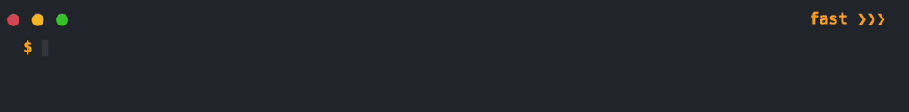
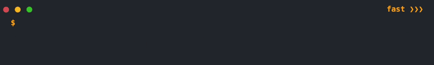

# animated-terminal.js:<br>A customisable animated terminal window using only 2 HTML tags

- Render an animated terminal window using only 2 HTML tags
- Lightweight, quick to install and easy to use
- No JavaScript knowledge needed 
- No additional JavaScript libraries needed
- Multiple functionalities and customisations

**animated-terminal.js** lets you render an animated terminal window, with multiple functionalities, using only 2 custom HTML tags, so you can use it without having to write a single line of JavaScript yourself! 

It uses **promises** and **async**/**await**, all in **vanilla Javascript**, so you don't need ANY additional library.

**animated-terminal.js** was initially inspired by [github.com/ines/termynal](github.com/ines/termynal). Then, since I needed some added features, I ended up creating my own improved implementation of the terminal, based on 2 main JavaScript components exported as HTML tags: `<terminal-window>` and `<terminal-line>`.


## How to install
Include **animated-terminal.js** in your project from a CDN, using the `<script>` tag.

```html
<script src="https://cdn.jsdelivr.net/gh/atteggiani/animated-terminal/animated-terminal.min.js"></script>
```

## Usage

1. First you need to create the terminal window, which is the wrapper, by using the `<terminal-window>` tag.
2. Then, inside the `<terminal-window>` wrapper, you can insert each lines with the `<terminal-line>` tag.
<br>
By default each `<terminal-line>` will be an *output* line, but you can make them *input* lines by adding the attribute `data="input"` to the `<terminal-line>` tag.

It's as simple as that!

Example:
```html
<terminal-window>
    <terminal-line data="input">Hello world! My name is Davide Marchegiani!</terminal-line>
    <terminal-line>I love animated-terminal.js!!</terminal-line>
</terminal-window>
```
will be rendered as:



### Default features
- Fast/Restart buttons to control the animation flow.<br>
<br><br>
- Style single words inside a `<terminal-line>` by wrapping them in a `<span>` tag and apply the desired styles.<br>
<br><br>
- If the content of a `<terminal-window>` is too long, the `<terminal-window>` will become scrollable, with automatic scroll enabled while the animation is running.<br>
<br><br>
- The animation starts only when the terminal is in the viewport (check the *init* attribute to change this feature).<br>
### Terminal *data* types
There are currently 4 *data* attributes you can assign to define a `<terminal-line>` or a `<terminal-window>`:

| *data* |  Description |
| --- | --- |
|'**output**' | An output terminal line. Gets printed out all at once (default option).|
|'**input**' | An input terminal line. It is preceded by an input character of a different color from the main text. It is typed letter by letter with a cursor animation.|
|'**prompt**' | A prompt terminal line. It is preceded by a prompt character of the same color as the main text. It is typed letter by letter with a cursor animation. |
|'**progress**' | A line showing the loading of a progress bar.|
---
<br>

Example:

```html
<terminal-window>
    <terminal-line data="output">Hello! I am an output terminal line!</terminal-line>
    <terminal-line data="input">Hey there! I'm an input terminal line!</terminal-line>
    <terminal-line data="prompt">Yoo! I'm a prompt terminal line!</terminal-line>
    <terminal-line data="progress"></terminal-line>
</terminal-window>
```

will be rendered as:


### Terminal customisation

You can assign a number of attributes to the `<terminal-window>` and `<terminal-line>` tags to customise the animation of the terminal.

Any attribute assigned to `<terminal-window>` will affect the whole terminal, while attributes assigned to `<terminal-line>` will only be valid for that specific line. 
<br>
If the same attribute is specified for both the `<terminal-window>` and `<terminal-line>`, the `<terminal-line>` attribute value will be applied for the current line.

#### `<terminal-window>` attributes

| Attribute | Options or *type(s)* [Default] | Description |
| --- | --- | --- |
| mode | ['dark'], 'light' | Defines the main terminal colorscheme. | 
| data | ['output'], 'input', 'prompt', 'progress'| Terminal data type for each line in the entire terminal. |
| startDelay | *str*, *int*, [300] | Delay before the start of whole terminal animation, in milliseconds. |
| lineDelay | *str*, *int*, [600] ('input' / 'prompt' lines), [100] ('output' / 'progress' lines) | Delay before the start of each terminal line animation, in milliseconds. |
| typingDelay | *str*, *int*, [80] ('input' / 'prompt' lines), [30] ('progress' line) | Delay between each typed ('input' / 'prompt' lines) or loaded ('progress' line) character in the terminal, in milliseconds. |
| imageDelay | *str*, *int*, [1500] | Delay before the `` content gets shown, in milliseconds (similar to lineDelay, but for `` tag). |
| imageTime | *str*, *int*, 'inf', [3000] | Amount of time for the `` content to be shown before being minimised, in milliseconds. 'inf' will keep the image maximised unless manually minimised. |
| progressChar | *str*, ['█'] | Character(s) to use for progress bar loading in the entire terminal. |
| progressPercent | *str*, *int*, [100] | Maximum percent of progress to show for the entire terminal. |
| cursor | *str*, ['▋'] | Character(s) to use for the cursor animation in the entire terminal. |
| inputChar | *str*, ['$'] | Character(s) to use before the 'input' line in the entire terminal. |
| promptChar | *str*, ['>>>'] | Character(s) to use before the 'prompt' line in the entire terminal. |
| directory | *str* | Directory path to insert before the *inputChar* in every 'input' line of the terminal. |
| PS1 | *str*, *HTML*| String to insert before the 'input' line  for the entire terminal. It entirely replaces both *directory* and *inputChar*. Can be formatted as HTML code to include styling.|
| init | - | If present, start the terminal animation as soon as the page loads, even if the terminal is not inside the viewport.|
| static | - | If present, create a static terminal without any animation.|

<br>

#### `<terminal-line>` attributes

| Attribute | Options or *type(s)* [Default] | Description |
| --- | --- | --- |
| data | ['output'], 'input', 'prompt', 'progress'| Terminal data type for current line. |
| lineDelay | *str*, *int*, [600] ('input' / 'prompt' lines), [100] ('output' / 'progress' lines) | Delay before the start of current line animation, in milliseconds. |
| typingDelay | *str*, *int*, [80] ('input' / 'prompt' lines), [30] ('progress' line) | Delay between each typed ('input' / 'prompt' lines) or loaded ('progress' line) character in the current line, in milliseconds. |
| progressChar | *str*, ['█'] | Character(s) to use for progress bar loading in the current line. |
| progressPercent | *str*, *int*, [100] | Maximum percent of progress to show for the current line. |
| cursor | *str*, ['▋'] | Character(s) to use for the cursor animation in the current line. |
| inputChar | *str*, ['$'] | Character(s) to use before the current 'input' line. |
| promptChar | *str*, ['>>>'] | Character(s) to use before the current 'prompt' line. |
| directory | *str* | Directory path to insert before the *inputChar* in the current 'input' line. |
| PS1 | *str*, *HTML* | String to insert before the current 'input' line. It entirely replaces both *directory* and *inputChar*. Can be formatted as HTML code to include styling.|
<br>

### Image / Video / GIF

Inside the `<terminal-window>` wrapper, **one** `` tag can be inserted (**note:** any further `` tags will be automatically removed) to show an image, video or GIF.

The `` tag content will be shown as an overlay inside the terminal window (whose height will be automatically set to max-height) with the animation following the position of the `` tag with respect to the other `<terminal-line>` tags in the `<terminal-window>`.

The `` tag content, once shown, can be manually minimised by clicking on it.
<br>
It can then be maximised again by clicking on the *IMG* icon at the bottom right of the terminal.

The `` tag can have the following attributes:

| Attribute | Options or *type(s)* [Default] | Description |
| --- | --- | --- |
| imageDelay | *str*, *int*, [1500] | Delay before the `` content gets shown, in milliseconds. |
| imageTime | *str*, *int*, 'inf', [3000] | Amount of time for the `` content to be shown before being minimised, in milliseconds. 'inf' will keep the image maximised unless manually minimised. |

Example:
```html
<terminal-window>
    <terminal-line data="input">python3</terminal-line>
    <terminal-line data="prompt">import matplotlib.pyplot as plt</terminal-line>
    <terminal-line data="prompt">plt.plot([1,2,3],[1,2,3]); plt.show()</terminal-line>
    
</terminal-window>
```
will be rendered as:


## Edit components' elements using *::part()*
Some sub-elements of the `<terminal-window>` and `<terminal-line>` components are editable using the CSS pseudo-element `::part`:
| Sub-element | ::part sintax |
|---|---|
| Terminal window | `::part(terminal-window)` |
| Terminal line | `::part(terminal-line)` |
| Fast button | `::part(fast-button)` |
| Restart button | `::part(restart-button)` |
| Directory | `::part(directory)`|
| Input character(s) | `::part(input-character)` |
| Prompt character(s) | `::part(prompt-character)` |
| Image | `::part(img)`|
| Image minimised icon | `::part(img-icon)` |

